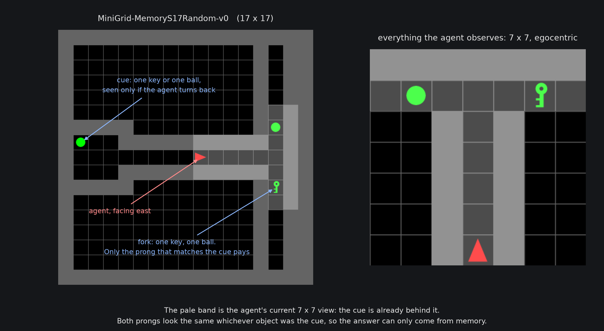
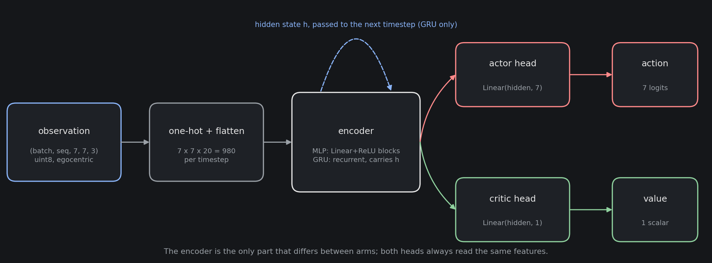
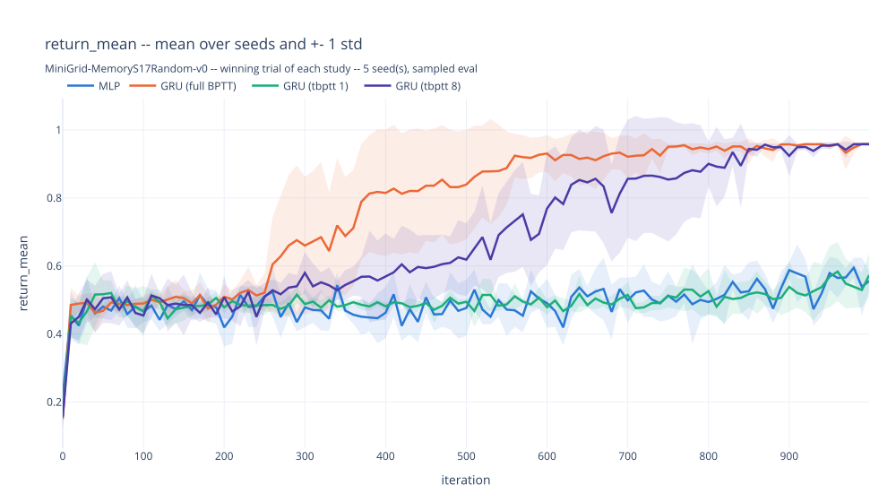

# Memory Reach: GRU vs MLP under PPO on MiniGrid Memory

> **Research question.** How far back does a policy's gradient actually have to
> reach before it can solve a task that a memoryless policy cannot — and what
> does that reach cost in training time and memory?

One PPO pipeline, two feature extractors, and nothing else changed between them:

- **MLP, the baseline.** Fully connected layers only. It sees the current 7x7
  observation and nothing else: no state is carried from one step to the next,
  and its gradient covers a single timestep. Whatever it scores is the ceiling
  for a policy that can only react to the frame in front of it.
- **GRU.** The same input, plus a hidden state `h` passed from step to step, so
  an observation from 100 steps ago can still be present at the moment of the
  decision. The gradient flows backwards along that chain, and `--tbptt L` caps
  how many steps back it is allowed to reach.

Hyperparameters are tuned per encoder with Optuna, so no encoder is judged on
another's settings, and every truncation length `L` gets its own independent
study.

---

## Install

Python **3.11** (developed on 3.11.15).

```bash
conda create -n rl_project python=3.11.15 -y
conda activate rl_project
pip install -r requirements.txt         
```

Core dependencies: `torch`, `gymnasium`, `minigrid`, `optuna`, `pygame-ce`.

---

## The task



`MiniGrid-MemoryS17Random-v0`: a cue object (a key or a ball) sits in a room at
the west end, the corridor forks into a T at the east end with a key at one
prong and a ball at the other, and the episode succeeds only if the agent walks
to the prong holding the same object as the cue.

Two properties make this a memory problem rather than a maze:

- **The cue is out of sight when the decision is made.** The agent sees a 7x7
  egocentric patch. By the junction the cue is long gone from view, so the
  observation there is identical whichever answer is correct. A memoryless
  policy cannot beat chance (~0.5), however well it is trained.
- **The information has to be sought out.** The agent spawns at a random spot in
  the corridor facing east, away from the cue. In most episodes it has to choose
  to turn around, walk back, look, and turn again. That detour costs a little
  reward and pays nothing until the memory also works.

Reward is MiniGrid's standard `1 - 0.9 * step_count / max_steps` on success and
0 otherwise.

---

## Training

**The network.** One shared encoder, two linear heads reading the same features:
the actor, which scores the 7 actions, and the critic, which predicts the value
of the state. The encoder is the only part that differs between arms.



One call to `PPOAgent.train()` is one PPO iteration: collect a rollout, turn it
into advantages, cut it into truncated sequences, then spend up to `n_epochs`
passes over it computing and backpropagating one loss.

**Rollout.** `n_workers` environments step in parallel for `worker_steps` steps
each, recording observations, actions, log probs, values, rewards and dones.

**Advantages.** Generalized Advantage Estimation walks the rollout backwards:

```
delta[t]      = reward[t] + gamma * V[t+1] * (1 - done[t]) - V[t]
advantage[t]  = delta[t] + gamma * gae_lambda * (1 - done[t]) * advantage[t+1]
return[t]     = advantage[t] + V[t]
```

`gamma` and `gae_lambda` are both tuned per encoder (see the search space
below). Advantages are standardized (zero mean, unit std) once over the whole
rollout, before any minibatch split; `return` is left on its own scale, since
that is what the critic has to predict.

**Sequence chunking.** Before the update, the rollout is cut at every episode
boundary and, additionally, every `tbptt_length` steps; that is what
`--tbptt L` sets. A chunk that starts mid-episode is seeded from the hidden
state the rollout already recorded there, so only the *backward* pass is
shortened; the encoder still sees the whole episode going forward. This is
also why truncating harder is not automatically cheaper (see
[Results](#results)): a `--tbptt 1` update has to run far more, far shorter
sequences than a full-BPTT one.

**The loss.** Three terms, combined and backpropagated once per minibatch:

```
loss = policy_loss + value_coef * value_loss - entropy_coef * entropy
```

- `policy_loss` is PPO's clipped surrogate objective. With
  `ratio = exp(new_log_prob - old_log_prob)`:
  `policy_loss = -mean(min(ratio * advantage, clip(ratio, 1 - clip_eps, 1 + clip_eps) * advantage))`.
- `value_loss` is the mean squared error between the critic's prediction and
  the GAE `return`.
- `entropy` is the policy distribution's entropy, subtracted, so it acts as a
  bonus for staying stochastic, not a penalty.

Every mean above is taken only over real (non-padding) timesteps; chunks are
padded to a common length inside a minibatch, and the padding never enters the
loss. Up to `n_epochs` passes are made over the whole rollout in shuffled
minibatches, and the gradient norm is clipped to `max_grad_norm` before the
optimizer step, so one lucky sparse-reward episode can't overwrite the policy
in a single update.

---

## Hyperparameter optimization process

One study per arm: 50 Optuna trials, TPE sampler seeded at 42. Each trial trains
the **same five seeds** `[0, 15, 12, 97, 98]` for 1000 iterations of 32 parallel
workers x 361 steps (about 11.6M environment steps per seed), then evaluates on
50 fixed mazes drawn from `eval_seed = 10000`.

**What is searched, and what is fixed** (identical ranges for both encoders, so
the widths a study settles on stay comparable):

| parameter | meaning | tunable | values |
|---|---|---|---|
| `lr` | learning rate for the optimizer | yes | 1e-5 to 1e-2, log scale |
| `gamma` | discount factor on future reward | yes | 0.99 to 0.9999, step 1e-4 |
| `gae_lambda` | bias/variance trade-off in GAE | yes | 0.9 to 0.99, step 0.01 |
| `clip_eps` | PPO's clipping range on the probability ratio | yes | 0.1 to 0.3, step 0.01 |
| `entropy_coef` | weight of the entropy bonus in the loss | yes | 1e-4 to 1e-1, log scale |
| `value_coef` | weight of the value loss in the loss | yes | 0.01 to 1.0, log scale |
| `wd` | weight decay on the optimizer | yes | 1e-8 to 1e-2, log scale |
| `max_grad_norm` | gradient-norm clip before the optimizer step | yes | 0.1 to 2.0, log scale |
| `hidden_size` | width of the encoder: the GRU's `h`, or an MLP layer | yes | 32 to 512, step 8 |
| `n_layers_mlp` | number of hidden Linear+ReLU blocks | yes, MLP only | 1 to 4 |
| `n_epochs` | passes over one rollout per update | no | 3 |
| `n_iterations` | PPO updates per training run | no | 1000 |
| `n_workers` | parallel environments in the rollout | no | 32 |
| `worker_steps` | steps each worker takes per rollout | no | 361 |
| `tbptt_length` | how far back the gradient may flow | no | set per study by `--tbptt L`, or full BPTT |

None of the fixed rows is searchable, so no trial can win by buying compute,
and no sampler ever ranks one truncation length against another.

**The score.** A trial is ranked on `mean_minus_1std(return_mean)`: the mean
return across the five seeds, minus one standard deviation across those same
five seeds. The spread is always taken across seeds, never across the eval
episodes of a single run, because the return here is bimodal (success or
failure) and within-run spread is then just a restatement of the success rate.
Subtracting the spread means a trial that is excellent on two seeds and broken
on three loses to one that is merely good on all five.

**Minibatch size is resolved by probing, largest first.** `mini_batch_size` is a
list of candidates from 4096 down to 4. Before iteration 0 a worst case
forward/backward runs on each candidate in turn and the largest one that fits in
VRAM wins, so every run is measured at the same memory budget instead of at an
arbitrary batch size, and an OOM retry wrapper guards each real update. The size
that won is logged and written into the checkpoint, since it depends on the
machine. It is reported per study in the results table below: full BPTT settles
an order of magnitude lower than `--tbptt 8` at the same GPU, because full length
sequences take far more memory per sequence.

### Hardware

| component | specification |
|---|---|
| GPU | NVIDIA GeForce RTX 3060 Laptop GPU, 12 GB VRAM, 12.9 TFLOPS (FP32), 299.3 GB/s bandwidth |
| CUDA | up to 13.2 |
| CPU | AMD Ryzen 9 7950X, 16 cores allocated of 32 |
| RAM | 16 GB total, 8 GB allocated to the run |

---

## Results

Five finished studies ship with the repo, so the reporting and viewing commands
work on a fresh clone without training anything. Every number is the winning
trial of that study, averaged over its five seeds; training time is that
winning trial's own wall-clock time, all five seeds trained sequentially, on
the hardware above.

| study | encoder | return mean | success rate | steps | hidden size | minibatch | training time |
|---|---|---|---|---|---|---|---|
| `pretrained_model_MLP/` | MLP, the baseline | 0.556 ± 0.029 | 0.592 ± 0.027 | 24.3 ± 2.3 | 360 (2 layers) | 1024 | 1.3 h |
| `pretrained_model_GRU_tbptt1/` | GRU, `--tbptt 1` | 0.573 ± 0.064 | 0.588 ± 0.068 | 9.8 ± 4.1 | 216 | 4096 | 2.6 h |
| `pretrained_model_GRU_tbptt4/` | GRU, `--tbptt 4` | 0.492 ± 0.001 | 0.500 ± 0.000 | 7.0 ± 0.0 | 360 | 4096 | 1.6 h |
| `pretrained_model_GRU_tbptt8/` | GRU, `--tbptt 8` | **0.958 ± 0.004** | **1.000 ± 0.000** | 16.8 ± 1.4 | 480 | 4096 | 2.0 h |
| `pretrained_model_GRU/` | GRU, full BPTT | **0.958 ± 0.002** | **1.000 ± 0.000** | 16.8 ± 0.9 | 280 | 512 | **1.3 h** |




**Performance: The cut-off is sharp, and it sits between L=4 and L=8.**

- `--tbptt 8` and full BPTT solve the task: 1.00 success, 0.958 return.
- Everything shorter fails at chance: `--tbptt 4` at 0.500, `--tbptt 1` at
  0.588, the MLP at 0.592. None of them beats a coin flip.
- Reaching back further than 8 adds nothing. So carrying `h` forward is not the
  thing that matters — every GRU arm does that. The *gradient* has to reach back
  to the observation that filled it, and four steps is not far enough.

**`steps` shows what the failures are doing.**

- **~16.8 steps = remembering.** Both solvers walk the detour: turn back, look
  at the cue, return to the fork.
- **~7 steps = guessing.** `--tbptt 4` runs straight to the fork and always
  picks the same side — the upper prong on four seeds, the lower one on the
  fifth, on every maze. In this eval set the upper prong is correct in exactly
  25 of 50 mazes, so any fixed side scores exactly 25/50. That is why its spread
  across seeds is 0.000: arithmetic, not convergence.
- `--tbptt 1` (9.8 steps) does the same thing less tidily. The MLP (24.3 steps)
  wanders first, then guesses.

**Price: full BPTT is also the cheapest.**

- It trains fastest of the GRU arms — **1.3 h**, matching the MLP — against
  1.6 h (`--tbptt 4`), 2.0 h (`--tbptt 8`) and 2.6 h (`--tbptt 1`). Shorter
  chunks mean more minibatches per epoch, so truncating hard costs time instead
  of saving it. (The middle two also differ in width, so only the extremes are
  a clean comparison.)
- It converges sooner too: 0.95 success at a median of 370 iterations, against
  640 for `--tbptt 8`.
- What it pays is **VRAM**: its minibatch probes down to 512, against 4096 for
  `--tbptt 8`, because full-length sequences are far bigger.

**Verdict: use full BPTT (`pretrained_model_GRU/`).** Best score, lowest
wall-clock, nothing gained by truncating. `--tbptt 8` is the fallback on a GPU
smaller than the 12 GB above. Below 8 you do not get a cheaper solution, you
get the MLP's guessing policy at GRU prices.

---

## Visualize

Everything here reads checkpoints already on disk; nothing here trains.

```bash
python compare.py                                  # redraw every finished study's comparison figures
python watch.py MLP                                # replay the hand-picked MLP run (the default)
python watch.py GRU                                # replay the hand-picked GRU run
python control.py                                  # play the env yourself from the keyboard
```

`compare.py` draws the winning trial of every finished study on shared axes,
one figure per metric, into `agents/comparison/`.

`watch.py` replays a trained checkpoint in a pygame window, stepping through
its evaluation episodes so a run can be watched and compared rather than just
scored. The commands above are the hand-picked (`no_hpo/`) runs shown by
default; `--hpo` watches a tuned run instead, and `--seed`, `--tbptt` and a
steps-per-sec argument select among them. See `python watch.py --help` for
every flag and in-window control.

`control.py` loads no model: it opens the exact env the agents train on and
hands you the controls, so you can walk the corridor yourself, move the
agent with the arrow keys, pick up and drop the cue, and see what the 7x7
egocentric observation actually contains at every step. See
`python control.py --help` for every flag, and the in-window controls list
for every key.

---

## Running the experiments

Run everything **from the repo root**: checkpoint paths and the Optuna
sqlite URL are relative to it. `MLP` and `GRU` are the only encoders. Every
flag of every entry point is documented in its own `--help`, e.g.
`python main.py --help`.

`main.py` runs the Optuna search for one arm (50 trials x 5 seeds), then
prints a report on the winner, and is resumable: it counts the trials already
in a study's `.db` and runs only the difference, so an interrupted study just
continues where it left off. These are the exact commands that produced the
five finished studies shipped in this repo:

```bash
python main.py MLP                 # saved in agents/pretrained_model_MLP/
python main.py GRU --tbptt 1       # saved in agents/pretrained_model_GRU_tbptt1/
python main.py GRU --tbptt 4       # saved in agents/pretrained_model_GRU_tbptt4/
python main.py GRU --tbptt 8       # saved in agents/pretrained_model_GRU_tbptt8/
python main.py GRU                 # saved in agents/pretrained_model_GRU/  (full BPTT, no --tbptt)
```

Once a study is finished it can be re-reported without retraining:

```bash
python main.py GRU --final-only    # reload best_trial/ and print the report, seconds
```

### Hand-picked runs (`no_hpo`), testing only, not part of the project

`main_no_hpo.py` is **not part of this project's results**: nothing in the
[Results](#results) table above comes from it. It skips Optuna entirely and
trains one seed at the fixed values in `config/config_no_hpo.py`, which
exists purely so a change (a new encoder, a different env, a refactor) can be
smoke-tested in minutes instead of paying for a 50-trial search.

```bash
python main_no_hpo.py GRU                  # one seed, full BPTT, saved in .../GRU/no_hpo/
python main_no_hpo.py GRU --tbptt 20       # saved in .../GRU_tbptt20/no_hpo/
python main_no_hpo.py MLP --report-only    # re-print an existing run, no retraining
```

### Retraining from scratch

To rerun the whole project, delete the relevant `agents/pretrained_model_*`
directory (or just its `hpo/` subdirectory) before starting; otherwise
`main.py` finds the old `.db` and resumes the finished study instead of
starting a new one. From the repo root:

```bash
rm -rf agents/pretrained_model_GRU_tbptt8/hpo   # one study's search only, keeps its no_hpo/ run
rm -rf agents/pretrained_model_GRU_tbptt8       # one study entirely
rm -rf agents/pretrained_model_*                # every study: the whole project
```

These are the checkpoints shipped with the repo, and nothing is recoverable
afterwards except by retraining, so copy the directory somewhere first if the
old numbers still matter.

Estimated running time for the whole project, all five studies above, back
to back, on the hardware listed earlier, taken from the logged duration of
every trial in each study's `hpo_csv_*.csv`: **about 236 hours (~10 days)**,
roughly 49 h (MLP), 61 h (`--tbptt 1`), 41 h (`--tbptt 4`), 44 h
(`--tbptt 8`), 41 h (full BPTT).

---

## Layout

```
config/
  config.py         Config: every shared PPO/env/eval/HPO knob. Abstract.
  config_{mlp,gru}.py   one per encoder; sets the extractor plus its architecture
                        knobs and appends them to the shared search space
  config_no_hpo.py  ConfigNoHPO: everything hand-picked, search_space = []
  helper.py         Helper: env builders, checkpoint I/O, batch-size probing,
                    Optuna persistence, plotting, both pygame viewers, Timing,
                    SequenceDataset
models/
  feature_extractor.py  MLP / GRU, both mapping
                        (batch, seq_len, 7, 7, 3) -> (batch, seq_len, hidden_size)
  model.py              Network: encoder plus linear actor head and critic head
agents/
  ppo.py            PPOAgent: rollouts, GAE, sequence batching, clipped loss,
                    evaluation, the training loop
  hpo_ppo.py        HPOPPO: wraps PPOAgent in an Optuna study
figures/
  make_task_figure.py   regenerates the task figure at the top of this README
  make_model_figure.py  regenerates the network figure in Training
main.py  main_no_hpo.py  compare.py  watch.py  control.py      entry points
```

---

## Questions

Found a bug, have a question about the results, or want to suggest an
extension? Open an issue or a pull request on this repo, or reach me
directly:

- Email: pham.anhkhoa1215@gmail.com
- GitHub: [@khoaphamanh](https://github.com/khoaphamanh)

I am happy to discuss the project, the task, or the code in more depth; just
say what you were trying to do and what you saw instead, and include the
study/encoder/`--tbptt` combination if it is result-related.
